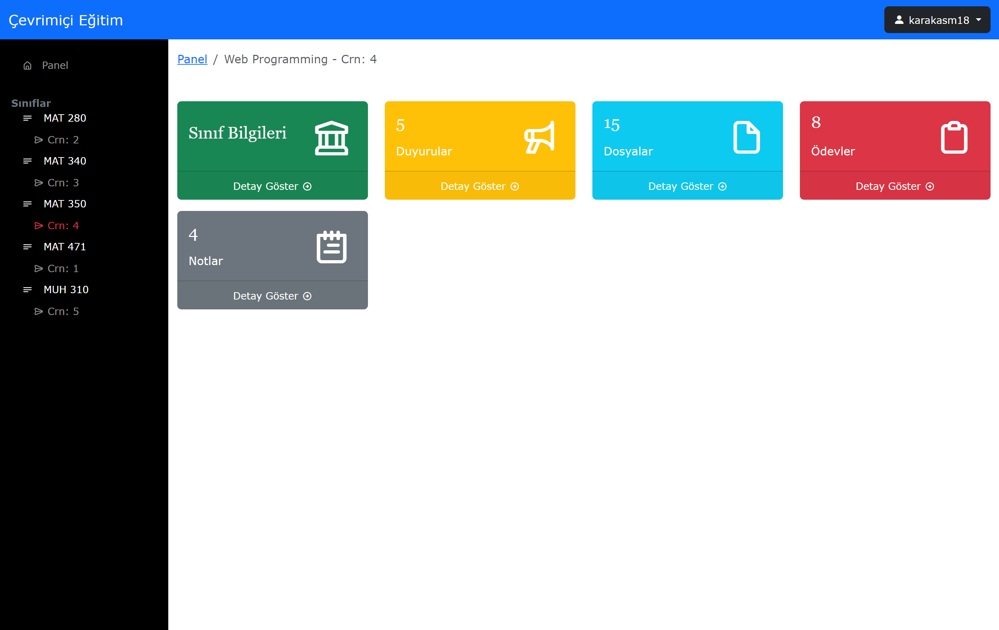

# Çevrimiçi Eğitim Sistemi
Bitirme projesi için Html, Css, Javascript, Bootstrap, PHP, Laravel, Livewire ve MySQL teknolojileri kullanılarak bir çevrimiçi eğitim sistemi uygulamas geliştirilmiştir.

# Proje Amacı
Bu çalışmanın amacı, güncel web teknolojilerinden yararlanarak eğitmenlere ve öğrencilere çevrimiçi ortamda uzaktan öğretme ve öğrenme imkânı sağlayan bir web sitesi tasarlamaktır.  Uygulama, temelde iki tip kullanıcıya açıktır. Bunlardan biri eğitmenler diğeri ise öğrencilerdir. Uygulama içerisinde kullanıcılara çeşitli imkanlar sunulmuştur. Bu imkanlar sayesinde; 

Eğitmenler; 
- Sınıflara özel duyurular paylaşabilir, 
- Dersle ilgili dosya ve kaynaklar paylaşabilir, 
- Ödevler verebilir, toplayabilir ve notlandırabilir, 
- Sınavların notlandırmalarını yapabilir.

Öğrenciler; 
- Duyuruları takip edebilir, 
- Yüklenen dosyalara erişebilir, 
- Ödev ve not bilgilerini görüntüleyebilir, 
- Ödevlerin cevaplarını yükleyebilir.  

# Varlık İlişki Diyagramı

# Bazı Sayfalar
<figure>
    
    <figcaption>Giriş Sayfası</figcaption>
</figure>  

## Eğitmen
<figure>
    
    <figcaption>Eğitmen Ana Sayfası</figcaption>
</figure>
 
 
<figure>
    
    <figcaption>Eğitmen Sınıf Detay Sayfası</figcaption>
</figure>
 
 
<figure>
    
    <figcaption>Eğitmen Duyurular Sayfası</figcaption>
</figure>
 
 
<figure>
    
    <figcaption>Eğitmen Duyuru Arama Örneği</figcaption>
</figure>
 
 
<figure>
    
    <figcaption>Eğitmen Duyuru Paylaş Sayfası</figcaption>
</figure>
 
 
<figure>
    
    <figcaption>Eğitmen Duyuru Detay Sayfası</figcaption>
</figure>
 
 
<figure>
    
    <figcaption>Duyuru Paylaşım Mail Örneği</figcaption>
</figure>
 
 
<figure>
    
    <figcaption>Eğitmen Dosyalar Sayfası</figcaption>
</figure>  

## Öğrenci
<figure>
    
    <figcaption>Öğrenci Ana Sayfası</figcaption>
</figure>
 
 
<figure>
    
    <figcaption>Öğrenci Sınıf Detay Sayfası</figcaption>
</figure>
 
 
<figure>
    
    <figcaption>Öğrenci Duyurular Sayfası</figcaption>
</figure>
 
 
<figure>
    
    <figcaption>Öğrenci Dosyalar Sayfası</figcaption>
</figure>

